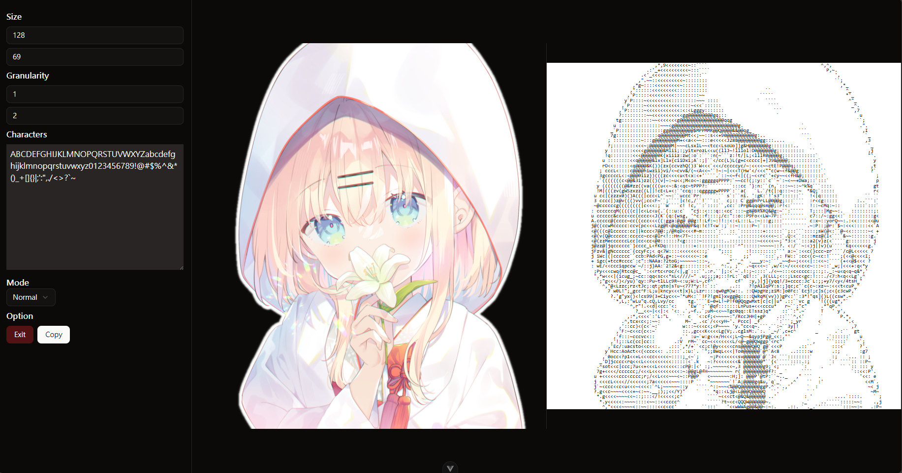

# ASCII Art Generator
A simple ASCII art generator that converts image to ASCII art (also supports any characters).
> Safe, Quick, Simple

### Safe
Works offline, no data will be uploaded to the server.

### Quick
Use [GPU.js](https://gpu.rocks) to accelerate the process.

### Simple
Just [open](https://xiao-e-yun.github.io/ASCIIArtGenerator/) it in your browser, select or drop an image, and you will get the ASCII art in seconds.

Preview 

[Try it online](https://xiao-e-yun.github.io/ASCIIArtGenerator/)

## Features
[x] Custom Output Size
[x] Any Characters (including square characters)
[x] Granularity Control
[ ] More Resize Algorithm (Only nearest currently)
[ ] Faster Character Parse
[ ] Video Support
